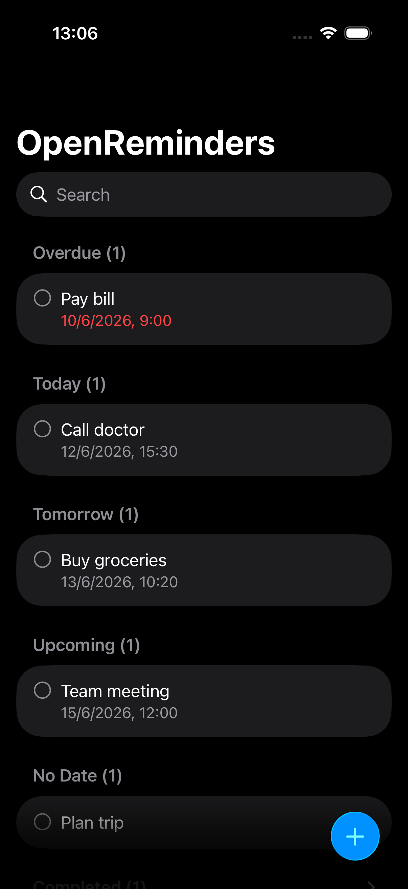
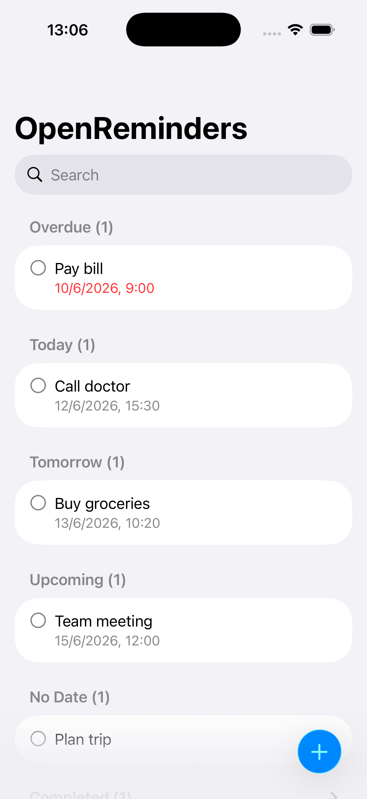

# OpenReminders
OpenReminder is an easy and quick-to-use reminder app for Apple platforms 

# Screenshots
<p align="left">
    
    
</p>

# Features

### Reminder
- Create reminder with a title, note, and optional date and time 
- Edit existing reminder 
- Search reminders 
- Mark reminders as completed

### User Interface
- Light and dark mode support
- Reminders are automatically grouped into the following sections:
    - Overdue
    - Today
    - Tomorrow
    - Upcoming 
    - Without date 
    - Completed

# Getting started 

## Build from Source
### Requirements
- Xcode 26 or later 

### Setup
1. Clone the repo:
```bash 
git clone https://github.com/atomi19/OpenReminders.git
```

2. Navigate to the project directory:
```bash
cd OpenReminders
```

3. Open the project in Xcode
```bash
open OpenReminders.xcodeproj
```

4. Select run destination
5. Build and run project 


# License
This project is licensed under the [MIT License](LICENSE.txt)
